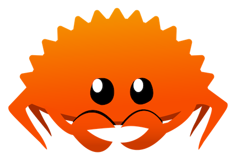

# Rust projects
Markdown repo pointing to all my rust projects

  

## Beginner-level

### [Todo List](https://github.com/DaviGGA/rust-todo-list)
Simple application using only the terminal with basic CRUD operations

## Intermediate-level

### [Rust shell](https://github.com/DaviGGA/shell-rust)
A shell utility CLI application done in Rust
